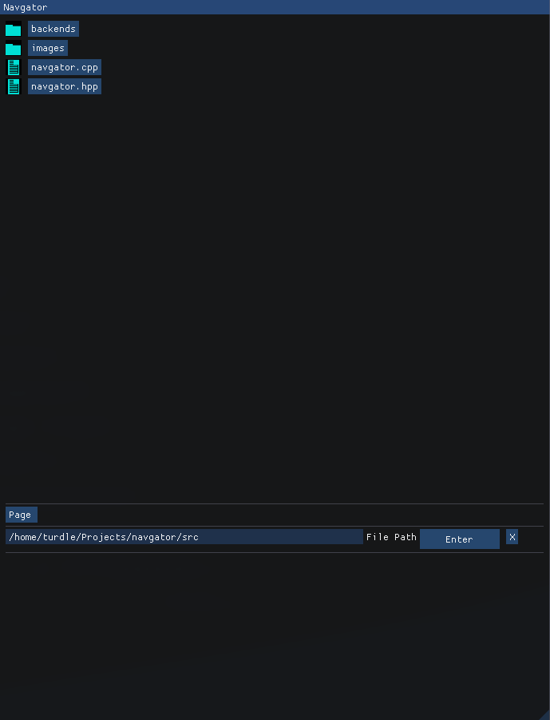

# Embeded File Explorer
Hopefully Cross Platform as well!

<<<<<<< HEAD
! [screen shot of navgator] (/page/screenshot.png)
! [another screenshot] (/page/screenshot2.png)
- [x] working on linux
=======

- [x] working on Linux
>>>>>>> 920a06c11c18f9d959e7ecf24efa80c8e50f64b6
- [ ] finish readme
- [ ] allow root directory on Linux
- [ ] working on windows
- [ ] specify what file types are being looked for
- [ ] suitability & bug test
